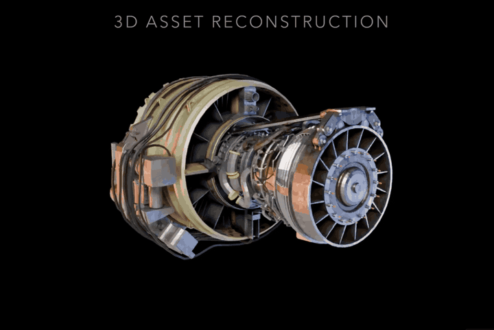

# EdTech 3D Asset Factory

CLI-first developer tool for generating educational science 3D assets from checked-in specs.

Pipeline: `asset.yaml` → OpenAI concept image → TRELLIS.2 image-to-3D → optimize → QA → web/Unity/Unreal export bundles, with an interactive browser workshop for prompt-driven generation and 3D preview.

## Reference Demo

[](https://x.com/HowToAI_/status/2056387308287676819)

Click the GIF to open the original X post.

## Fresh-server install

End-to-end from a bare Ubuntu host with an NVIDIA GPU to the workshop showing a green "Connected" indicator. The sections below this one are reference detail for each piece — this section is the linear path.

**Prerequisites**

- Ubuntu 22.04+ host with an NVIDIA GPU (≥16 GB VRAM; verified on RTX 5080 / sm_120 Blackwell)
- ~80 GB free disk (~37 GB Docker image + ~35 GB HuggingFace weights)
- OpenAI API key with image generation access

### 1. System packages

```bash
sudo apt update && sudo apt install -y \
  git python3.11 python3.11-venv python3-pip nodejs npm docker.io
```

Install the NVIDIA Container Toolkit so Docker can see the GPU:

```bash
curl -fsSL https://nvidia.github.io/libnvidia-container/gpgkey \
  | sudo gpg --dearmor -o /usr/share/keyrings/nvidia-container-toolkit-keyring.gpg
curl -fsSL https://nvidia.github.io/libnvidia-container/stable/deb/nvidia-container-toolkit.list \
  | sed 's#deb https://#deb [signed-by=/usr/share/keyrings/nvidia-container-toolkit-keyring.gpg] https://#' \
  | sudo tee /etc/apt/sources.list.d/nvidia-container-toolkit.list
sudo apt update && sudo apt install -y nvidia-container-toolkit
sudo nvidia-ctk runtime configure --runtime=docker && sudo systemctl restart docker
```

Verify: `docker run --rm --gpus all nvidia/cuda:12.8.1-base-ubuntu22.04 nvidia-smi` lists your GPU.

### 2. Clone and install

```bash
git clone https://github.com/PSkinnerTech/edtech-3d-asset-factory.git
cd edtech-3d-asset-factory
python3.11 -m venv .venv
.venv/bin/pip install -e ".[dev]"
.venv/bin/pytest -q          # sanity check
```

### 3. Build the frontend bundle

The workshop endpoint serves the prebuilt SPA from `frontend/dist/` — it 503s without this step.

```bash
( cd frontend && npm install && npm run build )
```

### 4. Build the TRELLIS Docker image

```bash
git clone https://github.com/wiresv/trellis2-runner.git
( cd trellis2-runner && docker build -t trellis2:blackwell . )
```

First build is ~20 min (compiles flash-attn / nvdiffrast / FlexGEMM against CUDA 12.8); resulting image is ~37 GB.

### 5. Download model weights (one-time, ~35 GB)

The runtime docker command uses `HF_HUB_OFFLINE=1` for speed and reproducibility, so weights must exist in `~/.cache/huggingface` before the first run. Both repos are required:

```bash
.venv/bin/pip install huggingface_hub
.venv/bin/huggingface-cli download microsoft/TRELLIS.2-4B
.venv/bin/huggingface-cli download microsoft/TRELLIS-image-large
```

### 6. Persist secrets

Stash the OpenAI key in a private file (mode 600) so launches don't need it re-exported:

```bash
sudo install -d -m 700 /root/.config/asset-factory
echo 'OPENAI_API_KEY=sk-…' | sudo tee /root/.config/asset-factory/env >/dev/null
sudo chmod 600 /root/.config/asset-factory/env
```

### 7. Launch the workshop (systemd)

Install `/etc/systemd/system/asset-factory-workshop.service`:

```ini
[Unit]
Description=EdTech 3D asset factory workshop
After=network-online.target docker.service
Wants=network-online.target

[Service]
Type=simple
WorkingDirectory=/root/code/edtech-3d-asset-factory
EnvironmentFile=/root/.config/asset-factory/env
Environment="TRELLIS2_COMMAND=docker run --rm --gpus all -e HF_HUB_OFFLINE=1 -e FLEX_GEMM_AUTOSAVE_AUTOTUNE_CACHE=0 -v /root/.cache/huggingface:/root/.cache/huggingface -v {image}:/work/concept.png:ro -v {output}:/work/output trellis2:blackwell /work/concept.png /work/output {resolution}"
ExecStart=/root/code/edtech-3d-asset-factory/.venv/bin/asset-factory workshop --port 8765
Restart=on-failure
RestartSec=2

[Install]
WantedBy=multi-user.target
```

The `{image}/{output}/{resolution}` tokens are literal placeholders the asset-factory substitutes — not shell variables. Leave them as-is.

```bash
sudo systemctl daemon-reload
sudo systemctl enable --now asset-factory-workshop
journalctl -u asset-factory-workshop -f
```

Binds `127.0.0.1:8765`. Auto-starts on boot, auto-restarts on crash. Header dot should be green.

Deploys: `cd /root/code/edtech-3d-asset-factory && git pull && (cd frontend && npm run build) && sudo systemctl restart asset-factory-workshop`. The frontend rebuild is required — the server serves the prebuilt SPA from `frontend/dist/`.

### 8. (Optional) Public access

The workshop is intentionally localhost-only. Front it with whatever you already use; the live deploy uses Caddy + a Cloudflare Tunnel. Minimal Caddyfile site block:

```caddyfile
3d.example.com {
    reverse_proxy 127.0.0.1:8765
    encode gzip zstd
}
```

## Development

```bash
python -m pip install -e ".[dev]"
pytest
```

## CLI

```text
asset-factory generate       Generate a complete asset run from an asset.yaml spec.
asset-factory batch          Generate multiple specs over one warm TRELLIS subprocess
                             (no per-asset model reload).
asset-factory qa             Run deterministic QA checks against an existing run.
asset-factory export         Rebuild an export profile from an existing run.
asset-factory workshop       Interactive prompt → image → 3D server.
asset-factory precache-seeds Pre-generate concept images for every seed spec.
```

## Seed Specs

`assets/seeds/` contains 10 initial science specs: 5 conceptual (biology, physics) and 5 realistic
(biology, earth science).

Run one against the mock runner — works without OpenAI credentials or a GPU:

```bash
asset-factory generate assets/seeds/chloroplast_conceptual.yaml --runner mock
```

The generated run directory:

```text
runs/chloroplast_001/<timestamp>/
  image/concept.png
  image/prompt.txt
  trellis/raw.glb
  trellis/raw_report.json
  optimize/asset.glb
  previews/thumbnail.png
  previews/turntable.webm
  exports/{web,unity,unreal}/asset.glb
  reports/qa.json
  manifest.json
```

Inspect the manifest:

```bash
python -m json.tool runs/chloroplast_001/<timestamp>/manifest.json
```

## TRELLIS.2 Runner Contract

The TRELLIS runner is invoked through `TRELLIS2_COMMAND` (single-shot) or `TRELLIS2_BATCH_COMMAND`
(warm process). Placeholders the asset factory substitutes:

- `{image}` — concept image path
- `{output}` — TRELLIS output directory
- `{resolution}` — voxel resolution

The command must create `{output}/raw.glb`. The asset factory writes `{output}/raw_report.json`
with stdout, stderr, return code, timing, and any failure details.

Batch mode protocol (`TRELLIS2_BATCH_COMMAND`): the process prints `READY` once loaded, then reads
`<image>\t<output>` lines on stdin; per line it writes `<output>/raw.glb` and prints
`OK\t<output>` or `ERR\t<output>\t<message>`. Exits on stdin EOF. This keeps the model resident
in VRAM across many assets.

## Local TRELLIS.2 Inference (Docker, Blackwell)

The companion repo `trellis2-runner` ships a Blackwell-compatible Docker image and a wrapper
script that satisfies both protocols.

Requirements: Linux host with an NVIDIA GPU (tested on RTX 5080 / sm_120), Docker with the NVIDIA
Container Toolkit, `OPENAI_API_KEY` for concept image generation, and TRELLIS.2 weights cached
under `~/.cache/huggingface`.

Build the image:

```bash
git clone https://github.com/wiresv/trellis2-runner.git
cd trellis2-runner
docker build -t trellis2:blackwell .
```

Single-shot generation:

```bash
export OPENAI_API_KEY="sk-…"
export TRELLIS2_COMMAND='docker run --rm --gpus all \
  -e HF_HUB_OFFLINE=1 \
  -v /root/.cache/huggingface:/root/.cache/huggingface \
  -v {image}:/work/concept.png:ro \
  -v {output}:/work/output \
  trellis2:blackwell /work/concept.png /work/output {resolution}'

asset-factory generate assets/seeds/chloroplast_conceptual.yaml --runner trellis
```

Batch (one container, many assets, no per-asset model reload):

```bash
export TRELLIS2_BATCH_COMMAND='docker run --rm -i --gpus all \
  -e HF_HUB_OFFLINE=1 \
  -v /root/.cache/huggingface:/root/.cache/huggingface \
  -v '"$PWD"'/runs:/work/runs \
  trellis2:blackwell --batch'

asset-factory batch \
  assets/seeds/chloroplast_conceptual.yaml \
  assets/seeds/mitochondrion_conceptual.yaml \
  --runner trellis
```

The batch mount must expose every `{output}` path the wrapper will be asked to write — keep all
runs under one parent dir (e.g. `runs/`) and bind that dir in.

## Workshop UI

`asset-factory workshop` serves an interactive prompt → image → 3D browser app on `127.0.0.1:8765`.
It reuses the same TRELLIS runner contract, so `OPENAI_API_KEY` and `TRELLIS2_COMMAND` must be set
in the launching shell.

```bash
cd frontend && npm install && npm run build && cd ..
asset-factory workshop --port 8765
```

The workshop persists each generation under `runs/workshop/<timestamp>/` so concept images and
GLBs survive restarts. Cached seed concept images live under `assets/seeds/cache/` and can be
pre-generated with `asset-factory precache-seeds` so the "Try one" chips in the UI load
instantly instead of waiting on OpenAI.

## Possible future improvements

### Keep TRELLIS warm in the workshop (batch mode)

**What:** Have the workshop hold one long-lived TRELLIS subprocess instead of spawning a fresh `docker run --rm` per `/api/run3d`. Identical pipeline → identical mesh/texture; the only thing eliminated is repeated cold start.

**Why:** Each Quality request currently burns ~25–60s on cold start (`docker run`, `import torch`, build CUDA context, load TRELLIS-2 + image-large checkpoints from `~/.cache/huggingface` into VRAM) before any inference. Reusing a warm process makes every request after the first ~25–35% faster. Verified: at start of a fresh Quality run, GPU sits at 0% / 4 MiB / 11 W for ~25s, then jumps to 100% / ~1.8 GB.

**Why this is a one-shot:** The runtime already exists at `src/asset_factory/runners/trellis.py::BatchTrellisCommandRunner` — it spawns the subprocess, waits for a `READY` line, services `<image>\t<output>` lines on stdin, and emits `OK\t<output>` / `ERR\t<output>\t<message>`. The CLI `batch` subcommand already drives it. Tests are in `tests/test_trellis_runner.py`. The work is wiring it into `review.py`.

#### Implementation spec

1. **`src/asset_factory/review.py`** — replace the per-request `TrellisCommandRunner.from_env()` in `_run_3d` with a module-level warm singleton:

   ```python
   # top of file
   from asset_factory.runners.trellis import BatchTrellisCommandRunner

   _BATCH_LOCK = threading.Lock()
   _batch_runner: BatchTrellisCommandRunner | None = None

   def _get_or_start_batch_runner() -> BatchTrellisCommandRunner:
       global _batch_runner
       if _batch_runner is None:
           runner = BatchTrellisCommandRunner.from_env()
           runner.__enter__()          # spawns docker; blocks until READY
           _batch_runner = runner
       return _batch_runner

   def _dispose_batch_runner() -> None:
       global _batch_runner
       if _batch_runner is not None:
           try: _batch_runner.close()
           finally: _batch_runner = None
   ```

   Rewrite `_run_3d` to hold `_BATCH_LOCK` across the whole call (the subprocess has one stdin/stdout pipe; the GPU is single-tenant anyway, so serializing is correct), call `_get_or_start_batch_runner().run(...)`, and on any exception call `_dispose_batch_runner()` before re-raising so the next request rebuilds a fresh process.

   Do not change `_stream_run_3d` — it already runs `_run_3d` in a worker thread and emits heartbeats from the main thread, which is exactly what the lock+blocking call needs.

2. **`/etc/systemd/system/asset-factory-workshop.service`** — replace the existing `Environment="TRELLIS2_COMMAND=…"` line with:

   ```
   Environment="TRELLIS2_BATCH_COMMAND=docker run --rm -i --gpus all -e HF_HUB_OFFLINE=1 -e FLEX_GEMM_AUTOSAVE_AUTOTUNE_CACHE=0 -v /root/.cache/huggingface:/root/.cache/huggingface -v /root/code/edtech-3d-asset-factory/runs:/root/code/edtech-3d-asset-factory/runs trellis2:blackwell --batch"
   ```

   **Critical:** the `runs/` bind mount must use **the same absolute path inside and outside the container**. `BatchTrellisCommandRunner` sends `request.concept_image.resolve()` and `request.output_dir.resolve()` (host-absolute paths) over stdin, and the container has to be able to open them at those exact paths. Do **not** use `-v $PWD/runs:/work/runs`-style remapping — that's only correct for the README's interactive CLI example, not for the workshop. The `{image}/{output}/{resolution}` placeholders from the single-shot command are gone — batch mode reads paths from stdin.

3. **Deploy:** `sudo systemctl daemon-reload && sudo systemctl restart asset-factory-workshop`. First `/api/run3d` after restart still pays one cold start while the warm process boots; every request after that skips it. Verify with `journalctl -u asset-factory-workshop -f` and a timed Quality run.

#### Constraints and tradeoffs

- **~2 GB VRAM held continuously** (measured at ~1.8 GB during inference). Fine on the 16 GB RTX 5080.
- **Concurrency:** one request at a time through `_BATCH_LOCK`. Queued requests still get heartbeats from `_stream_run_3d`; their `_run_3d` worker thread simply blocks until the lock is free. Don't try to multiplex — the subprocess can't.
- **Crash recovery:** if the docker container dies mid-run, `BatchTrellisCommandRunner.run` raises `RuntimeError` (it reports `closed stdout before responding` or similar). `_dispose_batch_runner()` clears the singleton; the next request transparently rebuilds. If rebuild itself fails (e.g. `docker` daemon down), the exception bubbles up `_stream_run_3d`'s `outcome["error"]` path and reaches the client as a JSON `{"error": "..."}` line — same surface as today.
- **Falling back:** to revert without redeploying code, swap the unit's `Environment=` line back to `TRELLIS2_COMMAND=…` and `git revert` the `review.py` change — the single-shot runner still exists untouched.

#### Tests to add

- `tests/test_review.py`: a fake `BatchTrellisCommandRunner` (monkey-patched in by setting `asset_factory.review._batch_runner` to a stub before calling `_run_3d` directly) that asserts (a) two sequential `_run_3d` calls reuse the same instance, (b) raising from `.run()` disposes the singleton so a third call calls `from_env()` again.
